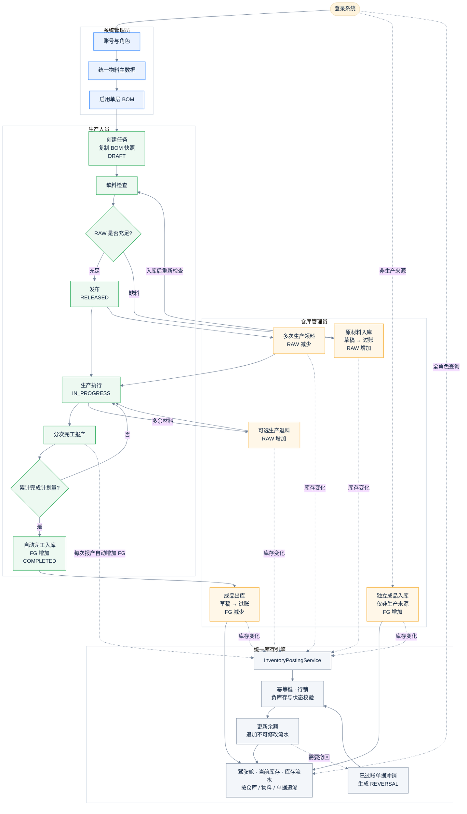
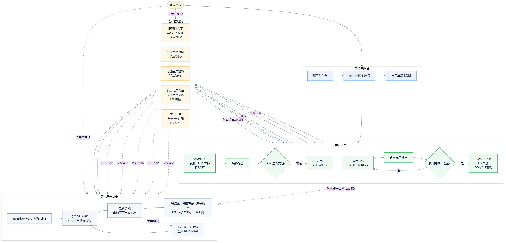

# 库存管理系统业务流程

这张角色泳道图说明系统管理员、生产人员和仓库管理员如何围绕 RAW 原材料库、FG 成品库及统一库存引擎完成库存与生产闭环。

## 读图要点

1. 基础数据先行：必须先维护物料和启用 BOM，生产任务创建时会复制 BOM 快照。
2. 缺料不发布：发布任务前按 RAW 当前库存检查需求量；缺料时先完成原材料入库并重新检查。
3. 库存统一过账：所有库存增减都经过 `InventoryPostingService`，草稿不会改变库存。
4. 生产允许分次执行：领料、退料和完工报产都可多次提交；达到计划数量后任务自动完成。
5. 两类成品入库不能混用：完工报产自动进入 FG；“成品入库”页面只处理不关联生产任务的其他来源。
6. 过账后不可改：已过账单据不能编辑或删除，只能冲销；冲销同样执行负库存和业务状态校验。
7. 余额可追溯：每次过账都会同时更新余额并写入不可修改流水，流水累计应与当前库存一致。

## 状态速查

| 对象 | 状态流转 |
| --- | --- |
| 库存单据 | `DRAFT 草稿 → POSTED 已过账 → VOIDED 已冲销` |
| 生产任务 | `DRAFT 草稿 → RELEASED 已发布 → IN_PROGRESS 生产中 → COMPLETED 已完成` |
| 任务取消 | 未完成任务可进入 `CANCELLED`；存在未退净领料时必须先退料 |

详细点击步骤见[《库存管理系统操作手册》](user-guide.md)。
