# 库存管理系统操作手册

版本：V1.0
适用对象：系统管理员、仓库管理员、生产人员
业务范围：物料/BOM、原材料入库、生产领退料、完工报产、成品入出库、库存与流水追溯

> 本手册中的库存变动都以“过账成功”为准。创建草稿、打开详情或执行缺料检查不会改变库存。

## 1. 角色与职责

| 角色 | 主要职责 | 可见业务入口 |
| --- | --- | --- |
| 系统管理员 | 账号、物料、BOM 和全局业务管理 | 全部页面和全部操作 |
| 仓库管理员 | 库存单据、生产领退料、库存查询 | 驾驶舱、三类库存单据、当前库存、库存流水、生产任务 |
| 生产人员 | 创建和发布任务、缺料检查、完工报产 | 驾驶舱、当前库存、库存流水、生产任务 |

系统管理员负责准备基础数据；仓库管理员负责实际库存收发；生产人员负责生产任务和完工数量。详细业务关系见[业务流程图](business-process.md)。

## 2. 公共操作

### 2.1 登录系统

**适用角色**：全部角色。

**前置条件**：账号处于启用状态，并已获得系统地址、账号和密码。

**操作步骤**：

1. 使用电脑或手机浏览器打开系统地址。
2. 输入账号和密码。
3. 点击“登录系统”。
4. 登录成功后，系统按角色展示对应菜单和驾驶舱快捷入口。

**成功结果**：进入库存驾驶舱，右上角显示当前姓名和角色。

**常见失败原因**：账号或密码错误、账号已停用、网络或服务不可用。连续失败时联系系统管理员确认账号状态并重置密码。

### 2.2 桌面与手机导航

桌面端使用左侧固定导航；点击顶部折叠按钮可收起或展开菜单。手机端点击左上角菜单按钮打开抽屉，选择页面后抽屉会自动关闭。

手机端只显示当前角色有权访问的菜单。例如生产人员看不到物料、BOM、账号和库存过账页面。

### 2.3 驾驶舱

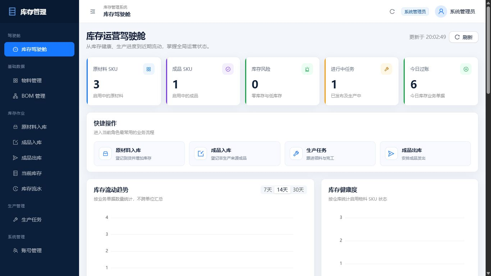

**适用角色**：全部角色，内容按角色调整。

**操作步骤**：

1. 查看原材料 SKU、成品 SKU、库存风险、进行中任务和今日过账。
2. 使用快捷操作进入当前角色常用页面。
3. 切换 7/14/30 天查看库存业务单据趋势。
4. 查看库存健康度、任务状态、风险清单和最近流水。
5. 需要最新数据时点击“刷新”；页面可见时系统也会定时刷新。

**成功结果**：驾驶舱展示来自 PostgreSQL 的实时聚合结果，不跨不同计量单位汇总物料数量。

**常见失败原因**：接口暂时不可用时页面会显示错误提示；空数据库时图表保持空状态，不会生成模拟数据。

## 3. 系统管理员操作

### 3.1 账号管理

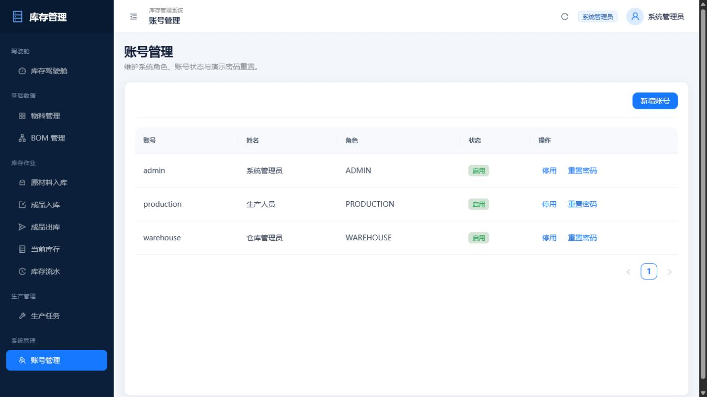

**适用角色**：系统管理员。

**前置条件**：使用管理员账号登录。

**操作步骤**：

1. 进入“系统管理 → 账号管理”。
2. 点击“新增账号”，填写账号、姓名、角色和至少 8 位的初始密码。
3. 对已有账号可执行“停用/启用”。
4. 点击“重置密码”时输入新的至少 8 位密码并确认。

**成功结果**：新增账号可按指定角色登录；停用账号不能登录；密码重置后旧密码立即失效。

**常见失败原因**：账号重复、密码少于 8 位、字段未填写完整。生产环境首次部署后应立即修改三个初始账号密码。

### 3.2 物料管理

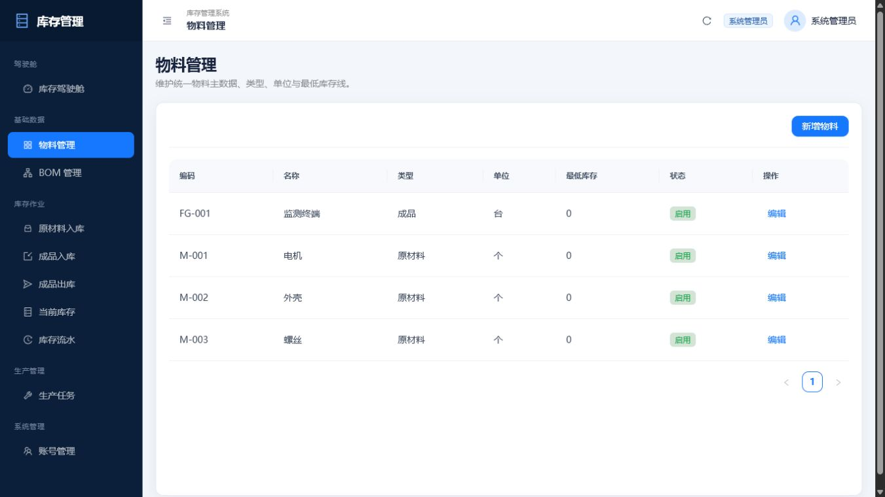

**适用角色**：系统管理员。

**前置条件**：明确物料编码、名称、类型、单位和最低库存。

**操作步骤**：

1. 进入“基础数据 → 物料管理”。
2. 点击“新增物料”。
3. 原材料选择 `MATERIAL`，成品选择 `FINISHED_GOOD`。
4. 填写计量单位和最低库存；保存后可在列表查询。
5. 对不再使用的物料执行停用，不删除历史业务数据。

**成功结果**：物料可以被对应的 BOM 或库存单据选择；最低库存参与驾驶舱库存风险判断。

**常见失败原因**：物料编码重复、类型选择错误、数量小数超过 4 位。物料类型创建后不应通过普通编辑改变。

### 3.3 BOM 管理

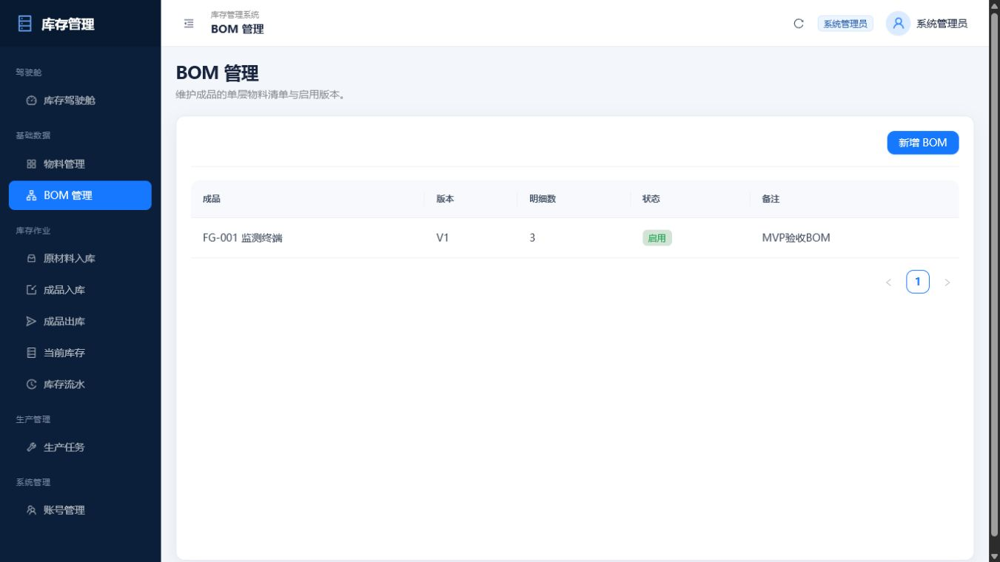

**适用角色**：系统管理员。

**前置条件**：成品和所需原材料均已创建并启用。

**操作步骤**：

1. 进入“基础数据 → BOM 管理”。
2. 点击“新增 BOM”，选择成品、版本和状态。
3. 添加原材料明细，填写每生产 1 个成品的单件用量。
4. 将使用中的版本设为“启用”。

**成功结果**：创建生产任务时系统复制当前启用 BOM，计算每项原材料需求总量。

**常见失败原因**：主项不是成品、明细不是原材料、单件用量不大于 0、同一成品已经存在另一个启用 BOM。任务创建后的 BOM 快照不会随主数据修改而改变。

## 4. 仓库管理员操作

### 4.1 库存单据的通用规则

原材料入库、独立成品入库和成品出库采用相同的操作模型：

1. 点击“新建入库单”或“新建出库单”。
2. 选择物料并填写数量，可增加多行明细。
3. 保存后生成 `DRAFT 草稿`，此时库存不变。
4. 检查无误后点击“提交”，二次确认后系统过账。
5. 过账成功后状态为 `POSTED 已过账`，余额和流水同时更新。
6. 已过账单据不能编辑或删除；确需撤回时点击“冲销”。

页面会自动为过账和冲销请求生成幂等键。网络重试或重复点击不会重复增减库存；同一幂等键对应不同请求时系统拒绝处理。

### 4.2 原材料入库

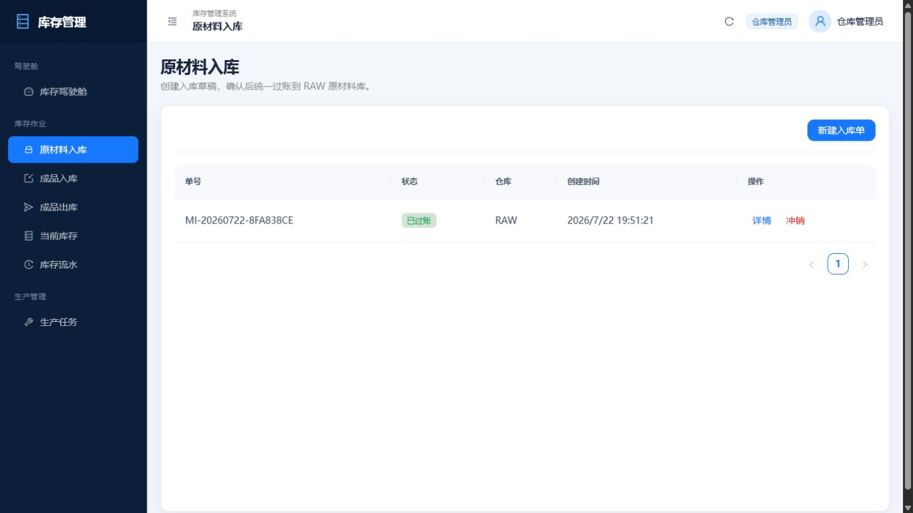

**适用角色**：仓库管理员、系统管理员。

**前置条件**：原材料已启用；实际到货数量已确认。

**操作步骤**：进入“库存作业 → 原材料入库”，新建入库单，选择原材料和数量，保存草稿后点击“提交”。

**成功结果**：单据进入已过账状态，RAW 对应物料库存增加并生成正数流水。

**常见失败原因**：选择了成品、物料已停用、数量不大于 0、草稿已经过账或被删除。

### 4.3 独立成品入库

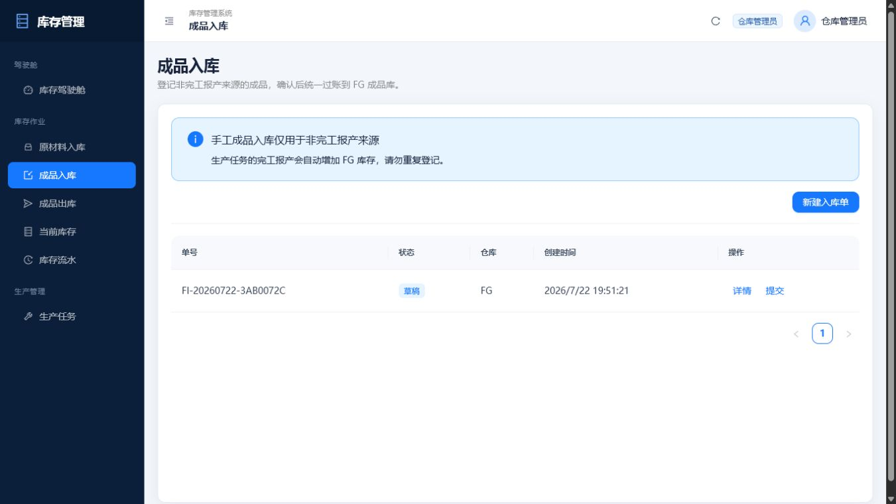

**适用角色**：仓库管理员、系统管理员。

**前置条件**：存在不关联生产任务的真实成品入库业务，成品物料已启用。

**操作步骤**：进入“库存作业 → 成品入库”，阅读页面提示，选择成品、填写数量和非生产来源说明，保存后提交过账。

**成功结果**：FG 库存增加，单号以 `FI` 开头，流水类型为成品入库。

**常见失败原因**：选择原材料、物料停用、将生产完工重复登记为手工入库。生产任务的完工报产已经自动进入 FG，不能在此重复录入。

### 4.4 生产领料与退料

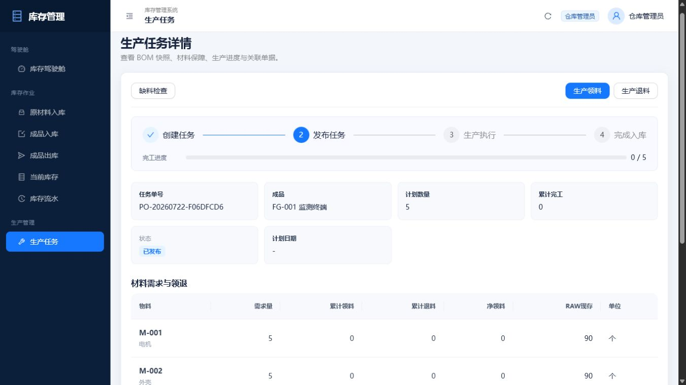

**适用角色**：仓库管理员、系统管理员。

**前置条件**：生产任务处于已发布或生产中，RAW 有足够库存。

**生产领料步骤**：

1. 进入“生产管理 → 生产任务”，打开任务详情。
2. 核对 BOM 快照需求、累计领料、累计退料、净领料和 RAW 现存。
3. 点击“生产领料”，选择物料并输入本次数量。
4. 确认提交，可按实际节奏多次领料。

**生产退料步骤**：点击“生产退料”，选择物料并输入退回数量，确认后退回 RAW。

**成功结果**：领料使 RAW 减少并更新任务累计领料；退料使 RAW 增加并更新累计退料和净领料。首次领料后任务进入生产中。

**常见失败原因**：库存不足、累计净领料超过需求量的 110%、退料超过当前净领料、任务已完成或取消。

### 4.5 成品出库

**适用角色**：仓库管理员、系统管理员。

**前置条件**：成品已启用，FG 当前库存大于或等于本次出库量。

**操作步骤**：进入“库存作业 → 成品出库”，新建出库单，选择成品和数量，保存草稿后提交过账。

**成功结果**：FG 库存减少，生成负数流水；草稿数量大于库存时只有过账阶段会被拒绝，余额保持不变。

**常见失败原因**：库存不足、选择原材料、物料停用、单据状态不允许过账。

### 4.6 冲销

**适用角色**：仓库管理员、系统管理员。

**前置条件**：原业务单据已过账且尚未冲销，反向处理不会违反库存或生产累计约束。

**操作步骤**：在对应库存单据列表找到已过账单据，点击“冲销”并二次确认。

**成功结果**：系统新建 `REVERSAL` 单据和相反方向流水，原单据变为 `VOIDED 已冲销`。

**常见失败原因**：成品入库后的库存已经被出库，冲销会造成负库存；生产关联单据冲销后会破坏任务累计关系；原单据已冲销。

## 5. 生产人员操作

### 5.1 创建、检查并发布任务

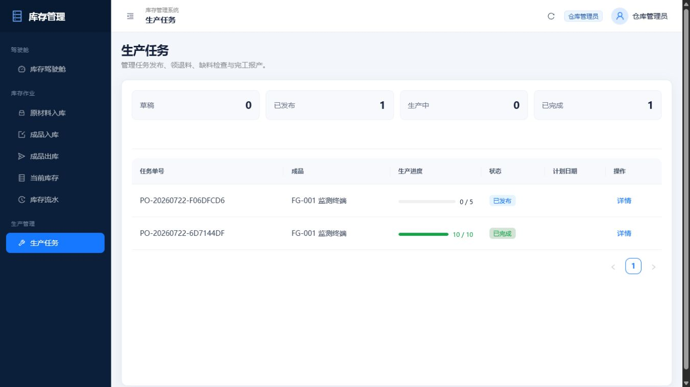

**适用角色**：生产人员、系统管理员。仓库管理员可以查看，但不能创建或发布。

**前置条件**：目标成品有且仅有一个启用 BOM。

**操作步骤**：

1. 进入“生产管理 → 生产任务”，点击“新建任务”。
2. 选择成品，填写计划数量、计划日期和备注。
3. 保存后打开详情，核对 BOM 快照和需求总量。
4. 点击“缺料检查”。如有短缺，将明细交给仓库补充入库。
5. 库存充足后返回列表，点击“发布”。

**成功结果**：任务由草稿进入已发布，仓库管理员可以执行领料。

**常见失败原因**：没有启用 BOM、计划数量不大于 0、RAW 缺料、任务已不是草稿。

### 5.2 分次完工报产

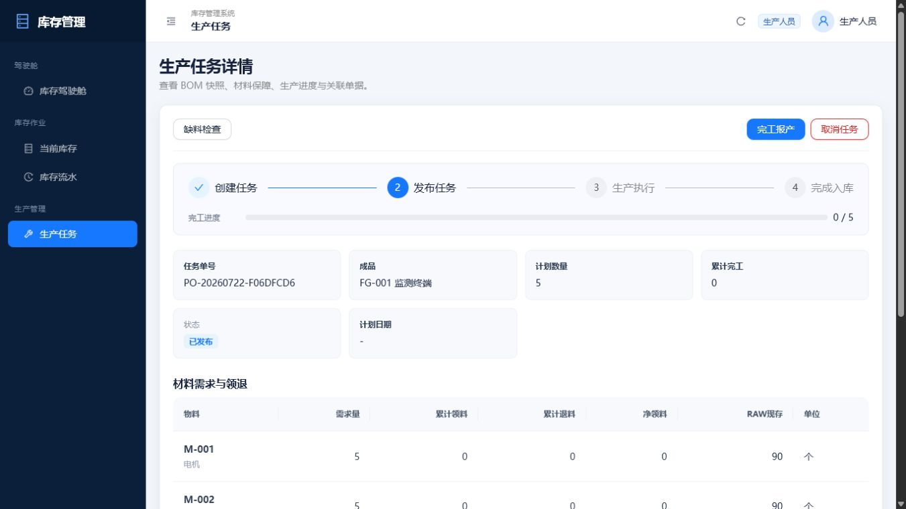

**适用角色**：生产人员、系统管理员。

**前置条件**：任务处于已发布或生产中，本次完工数量已经确认。

**操作步骤**：

1. 打开任务详情，核对计划数量、累计完工和材料数据。
2. 点击“完工报产”。
3. 输入本次完工数量并确认。
4. 未达到计划量时可继续分次报产；达到计划量后无需手工关闭任务。

**成功结果**：每次报产原子生成完工入库单并增加 FG；累计完工等于计划量时任务自动进入已完成。

**常见失败原因**：累计完工超过计划量、任务已完成或取消、重复请求使用了冲突的幂等键。

手机端的材料表会自动转换为纵向业务卡片，操作按钮和详情仍保持完整。

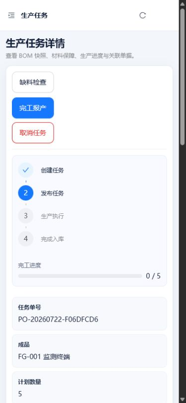

### 5.3 取消任务

**适用角色**：生产人员、系统管理员。

**前置条件**：任务尚未完成。

**操作步骤**：打开任务详情，点击“取消任务”并确认。

**成功结果**：符合条件时任务进入已取消，不再允许领料、退料或报产。

**常见失败原因**：任务存在未退净领料。系统不会自动生成虚拟退料，必须先由仓库管理员将所有材料退净后再取消。

## 6. 库存查询与追溯

### 6.1 当前库存

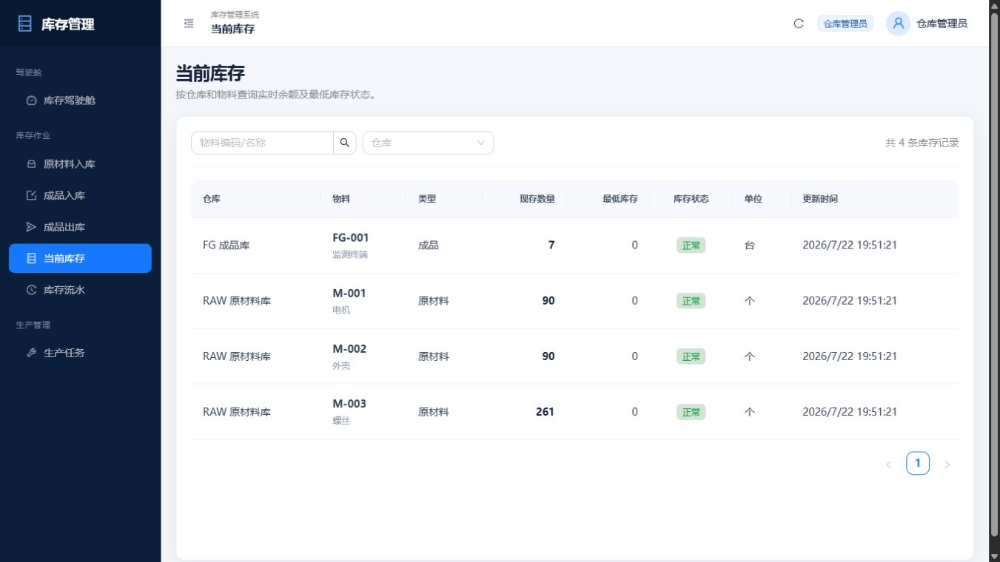

**适用角色**：全部角色。

**操作步骤**：进入“库存作业 → 当前库存”，按物料编码/名称搜索，或按 RAW、FG 仓库筛选。

**结果说明**：现存为 0 显示零库存；大于 0 且小于等于最低库存显示低库存；高于最低库存显示正常。

### 6.2 库存流水

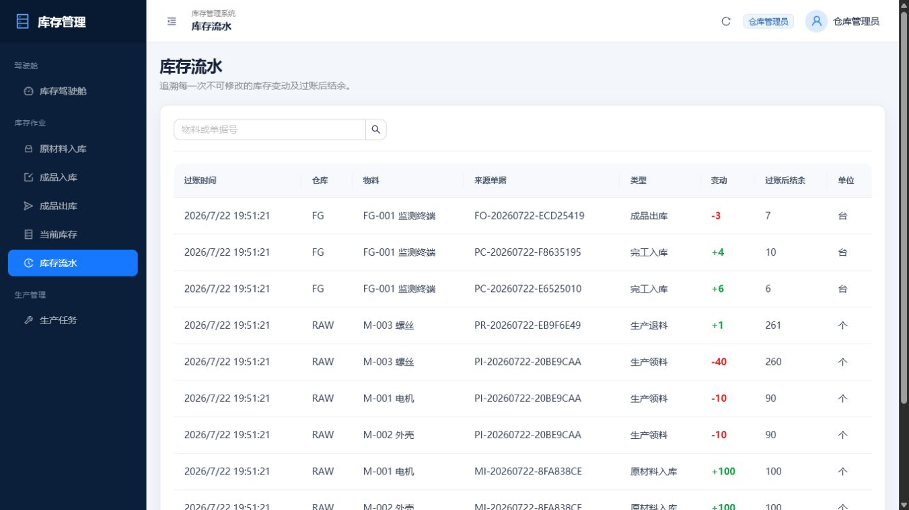

**适用角色**：全部角色。

**操作步骤**：进入“库存作业 → 库存流水”，按物料、仓库、单据类型和日期筛选；通过来源单号追溯业务。

**结果说明**：正数表示入库或退回，负数表示领用或出库；每条流水记录变动后结余、业务类型、来源单据、时间和操作人。流水不能编辑或删除。

## 7. 固定验收场景

| 步骤 | 操作角色 | 操作 | 预期结果 |
| --- | --- | --- | --- |
| 1 | 管理员 | 确认 M-001/M-002/M-003、FG-001 和 BOM `1/1/4` | 基础数据可用 |
| 2 | 仓库 | 原材料入库 `100/100/300` 并过账 | RAW 为 `100/100/300` |
| 3 | 生产 | 创建 10 台任务并发布 | 需求为 `10/10/40` |
| 4 | 仓库 | 领料 `10/10/40` | RAW 为 `90/90/260` |
| 5 | 仓库 | 退螺丝 1 | RAW 螺丝为 `261`，净领为 `39` |
| 6 | 生产 | 第一次报产 6 | FG 为 `6` |
| 7 | 生产 | 第二次报产 4 | FG 为 `10`，任务已完成 |
| 8 | 仓库 | 成品出库 3 | FG 为 `7` |
| 9 | 系统 | 重复相同幂等请求 | FG 仍为 `7` |
| 10 | 仓库 | 尝试出库 8 | 返回库存不足，FG 仍为 `7` |
| 11 | 全角色 | 查询库存和流水 | 每个仓库+物料的流水累计等于余额 |

## 8. 常见问题

### 发布任务提示缺料

根据缺料明细核对物料、需求量和可用量。由仓库管理员完成原材料入库并过账，再重新执行缺料检查。

### 库存单据保存后库存没有变化

新建后只是草稿。必须点击“提交”且过账成功，余额和流水才会变化。

### 提示库存不足

系统禁止负库存。检查当前仓库、物料和可用数量；失败请求不会改变余额。

### 提示超过 110% 领料上限

减少本次领料量，或核对任务 BOM 快照与实际需求。MVP 不提供无上限超领。

### 退料被拒绝

退料不能超过该物料当前净领料，即“累计领料 - 累计退料”。

### 完工报产被拒绝

本次完工加累计完工不能超过计划数量；任务完成后不能继续报产。

### 任务无法取消

存在未退净领料时先联系仓库管理员完成退料。所有物料净领料为 0 后再取消。

### 冲销失败

冲销也执行负库存和生产累计校验。先处理依赖原单据的后续出库、领料或报产业务，再重新冲销。

### 重复提交或幂等冲突

完全相同的重复请求返回首次成功结果，不会重复改变库存；同一幂等键对应不同内容时返回冲突，需要发起新的业务请求。

## 9. 日常检查建议

**管理员**：检查账号状态、基础数据完整性、启用 BOM 唯一性和驾驶舱异常。

**仓库管理员**：先处理库存风险和待执行单据，过账前核对物料、仓库和数量，班末检查流水。

**生产人员**：发布前检查缺料，报产前核对累计完工，取消任务前确认所有材料已退净。
